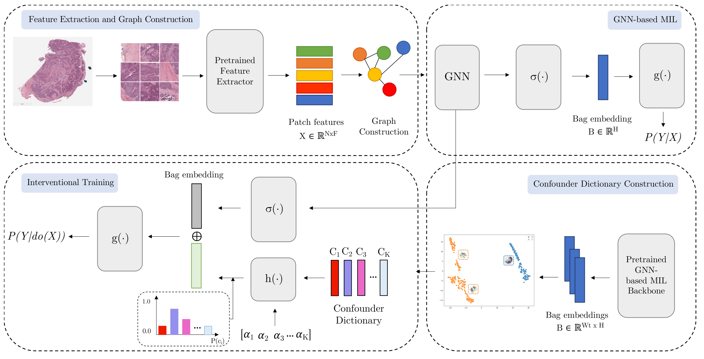

# GMIL-IT: Graph-based Multiple Instance Learning w/ Interventional Training  

[UNDER CONSTRUCTION] Official repository for GMIL-IT: Graph-based Multiple Instance Learning with Interventional Training, Findings of ML4H24.  

  

---

## Installation  

The code was tested with **Python 3.10** in a virtual environment. To install dependencies, run:  

```bash
pip install -r requirements.txt
```

**Note:** If you use an older Python version (e.g., **Python 3.7**), the **region graphs method will not work**, as `scikit-image` lacks the required function in older versions.

---

## Feature Extraction & Graph Construction  

We used the **CLAM pipeline** to extract features for each dataset.  
If you wish to extract features from your own dataset, refer to:  
[CLAM GitHub Repository](https://github.com/mahmoodlab/CLAM)  

For **Camelyon16** and **Camelyon17**, we used the preset:  
```bash
bwh_biopsy
```
We might make our extracted features available later.  

### **Building Graphs**  

To construct **region graphs**, run:  

```bash
python STEP1_build_graphs.py --type_graph region \
    --feats_path FEATURE_DIRECTORY \
    --h5_path CSV_PATH \
    --graph_save_path GRAPH_SAVE_PATH
```

**Arguments:**  
- `FEATURE_DIRECTORY` → Path to extracted features  
- `CSV_PATH` → `.csv` file containing dataset file names and labels  
- `GRAPH_SAVE_PATH` → Output directory for saved graphs  

---

## Training Graph-MIL  

To train a **Graph-MIL model on Camelyon17**, run:  

```bash
python STEP2_train_graph_mil_c17.py --num_classes 1 \
    --input_dim 1024 \
    --mil_model MIL_MODEL \
    --gnn_model GNN_MODEL \
    --graph_folder GRAPH_SAVE_PATH \
    --output_dir OUTPUT_FOLDER
    --data_dir CSV_PATH
```

**Arguments:**  
- `MIL_MODEL` → MIL model (`abmil`, `dsmil`)  
- `GRAPH_SAVE_PATH` → Path to saved graphs  
- `OUTPUT_FOLDER` → Directory to save results 
- `CSV_PATH` → `.csv` file containing dataset file names and labels 

> **Camelyon16 support is under construction.**  

### **Using Other Datasets**  

If you want to train on a different dataset, you must **modify the training script** to ensure:  
- Proper dataset loading  
- Adaptation for dataset-specific splits (e.g., **Camelyon17 folds based on hospitals**)  

---

## Repository Structure  

```
GMIL-IT/
│── models/                # Graph-MIL models  
│── utils/                 # Utility scripts  
│   ├── Dataset.py         # Dataset processing  
│   └── evaluation.py      # Evaluation & normalization  
│── Camelyon17.csv         # Dataset file names & labels  
│── STEP1_build_graphs.py  # Graph construction script  
│── STEP2_train_graph_mil_c17.py  # Training script for Camelyon17  
│── requirements.txt       # Dependencies  
```

---

## TODO (Under Construction)  

- [ ] Add support for **Camelyon16**  
- [ ] Release pre-extracted **Camelyon17** features  
- [ ] Improve **generalization for other datasets** 
- [ ] Release STEP3 corresponding to Interventional Training 

---

### Contact  
If you have questions or issues, feel free to open an **Issue** or reach out.  

---

